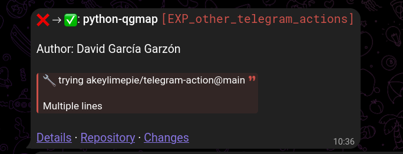

# gha-notify-telegram

A Github Action to notify Telegram CI results.

This does not intent to duplicate the many other
[generic telegram notifier](https://github.com/marketplace?query=telegram) actions around.
It centralizes, for all my personal projects, choices for:

- which of those telegram actions to pick
- when to trigger the notification
- what the message should contain

## Features

- Smart notifications considering prevous CI status of the branch
    - Reports any non successfull run
    - Reports any run after a non-successfull one
    - Do not report success -> success changes, unless otherwise specified
- The current message format is this:
  
- No need to gather info, it is obtained from generic github context.


## Inputs

### `token`

Telegram bot token.

Obtain it by talking with @BotFather and issuing the command `\newbot`.

### `to`

Numeric Telegram channel ID

For most channels you can see the id in the url of the web interface (web.telegram.com)
when you visit the channel.
Some channels show the @ o # name. Those name won't work.
In those cases you can send a message and
the response will tell you the numeric ID.

```bash
curl -X POST "https://api.telegram.org/bot${TELEGRAM_TOKEN}/sendMessage" -d "chat_id=@MyChannel&text=my sample text"
```
Be aware that some ids are negative numbers and the `-` sign should be included.

### `report_green_to_green`

If false green to green transitions on a branch will not be reported.
Default to false.


## Example

```yaml
  ....
      - name: 📢 Notify status changes
        if: always()
        uses: vokimon/gha-notify-telegram
        with:
          token: ${{ secrets.TELEGRAM_TOKEN }}
          to: ${{ secrets.TELEGRAM_CHAT_ID }}
          # the default to false should be more digest
          report_green_to_green: true
```


